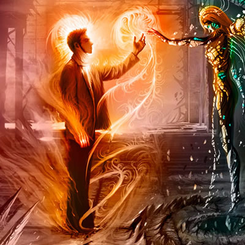

# puzzle.js
**Description:** Its very simple puzzle game plugin based on jQuery

 * jQuery Puzzle game Plugin
 * Copyright (c) 2011 http://cameopix.com/
 * Version: 1.0.11 (22-07-2011)
 * Dual licensed under the MIT and GPL licenses:
 * http://www.opensource.org/licenses/mit-license.php
 * http://www.gnu.org/licenses/gpl.html
 * Requires: jQuery v1.2.6 or later
 
# Demo :


http://cameopix.com/puzzle/
# Documentation
#JS
```javascript
$(document).ready(function(){
    $('#puzzle').puzzle({
        __rows:4,
        __columns:4,
    });
)};
```
#CSS
```CSS
#loader
    {
        background:url(images/loadssing.gif) no-repeat; 
        height:48px;
        width:47px;
        margin:0px;
        margin-top:150px;
        margin-left:50px;
    }
#puzzle{	
        position:absolute;
        z-index:50;
        margin:23PX;
        border:1px solid #EAEAEA;
        margin-top:-205px;
    }
#puzzle IMG { position:absolute; z-index:50}
#preview 
        {
        height:100px; width:43px;
        line-height:50px;
        cursor:pointer;
    }
```
#Html
```HTML
    <div id="puzzle">
        
        
        
    </div>
```
